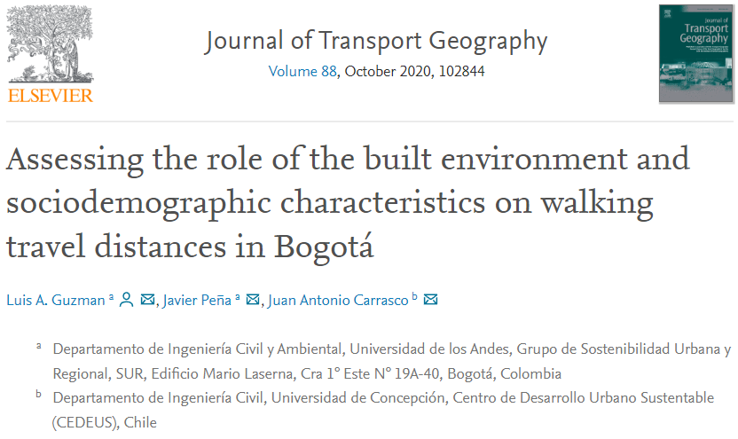
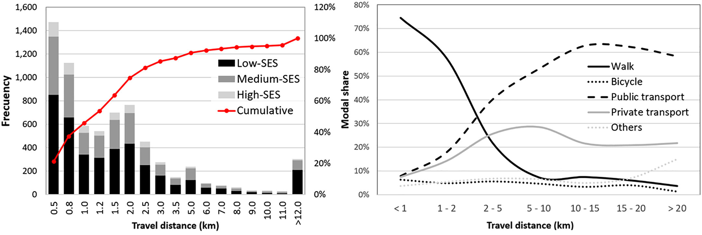
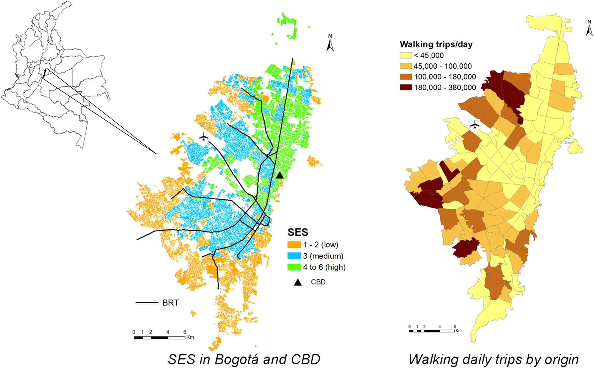
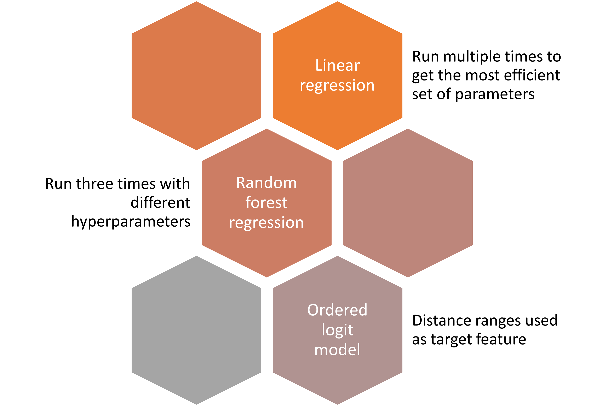
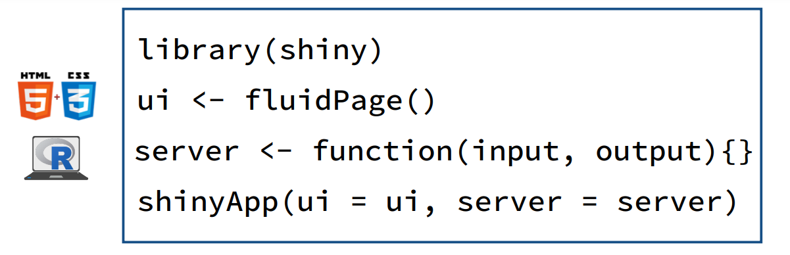

<!-- HTML format -->

```{=html}
<style type="text/css">
h1.title {font-size: 32px;}
h1 {font-size: 30px;color: #00008B}
h2 {font-size: 24px;color: #4169E1}
h3 {font-size: 22px;color: #808080}
h4 {font-size: 20px;color: #808080}
 p {font-size: 18px;color: black} 
li {font-size: 18px;color: black}
.table th:not([align]) {text-align: left;}
</style>
```
```{r setup, include=FALSE}
knitr::opts_chunk$set(echo = TRUE,warning = FALSE, message = FALSE)
knitr::opts_chunk$set(fig.width=6, fig.height=4, fig.align = "center") 
```

```{r, echo=FALSE}
# Libraries
library(kableExtra)
library(randomForest)
library(MASS)
library(tidyverse)
```

# A model to predict the average travel distance of Bogota residents: *Model estimation, visualization and deployment*

## Table of contents

-   Introduction
-   Data sources

## Introduction

This project is inspired on the author previous work published as a paper on the journal of transport geography.



<https://doi.org/10.1016/j.jtrangeo.2020.102844>

This project creates an application based on the econometric model to predict average travel distance described on the paper. Furthermore, the application was deployed to the shiny apps server so it can be accessed remotely on the following link <https://jpb2288.shinyapps.io/mix_test/>

## Data sources

This data set is the 2015 home mobility survey in the capital city of Colombia, Bogota. It gives information about the mobility patterns on a typical working day, i.e. Tuesday to Thursday. It records for a sample of households, the modes of transport used and time spent on each leg of their trips, as well as other socioeconomic aspects for all family members such as income, car ownership, education, etc... An expansion factor is given in order to generalize characteristics of a surveyed individual to a larger number on the population.

The data is presented in csv files with three main modules related to the following categories: 1. Household, 2. Individuals, 3 Trips. All of them are related since individuals who belong to a household are the ones that make trips. Household ID serves as key to link information from one level to another.

The data can be retrieved from the open data site managed by city of Bogota authorities site: <https://www.simur.gov.co/encuestas-de-movilidad>

The official language in Colombia is Spanish,therefore some names at the beginning of the analysis will be used in that language but then translated to English. The following chunk of code indicates the initial data analysis.

### Data loading and merging

The first step is the creation of a single data frame that have the information for household, person and trip

```{r eval=F, include=T}

path_to_survey <- "H:/.shortcut-targets-by-id/0Bzyr0SveNi4AUWl3aC1fT2kzclk/Encuesta de Movilidad 2015/Base de Datos Completa/"
HOG <- read_csv(paste0(path_to_survey,"ENCUESTAS_ANONIMIZADO.csv")) # file for household information 
PERS<- read_csv(paste0(path_to_survey,"PERSONAS_ANONIMIZADO.csv"))  # file for person information
VIAJ<- read_csv(paste0(path_to_survey,"VIAJES_ANONIMIZADOS.csv"))   # file for trip information

#Here a the non-informative variables such as surveyor name are excluded from the trip data base 
BD_ModDR<- VIAJ[,c("ID_ENCUESTA","NUMERO_PERSONA","NUMERO_VIAJE",
                   "CODVIAJ","ID_MOTIVOVIAJE","Dist_Red",
                   "ID_MEDIO_PREDOMINANTE","LATITUD_ORIGEN", "LONGITUD_ORIGEN")]
BD_ModDR$CODPERS<-paste(BD_ModDR$ID_ENCUESTA,BD_ModDR$NUMERO_PERSONA, sep = "") #A unique person code is generated
                   
#A simmilar process is carried out for the person data base 

PERS<- PERS[,c("ID_ENCUESTA","NUMERO_PERSONA","ID_SEXO","EDAD",
                       "ID_NIVELEDUCATIVO","ID_ACTIVIDAD","LIMITACION_FISICA",
                       "ID_LICENCIACONDUCCION1", "REALIZO_DESPLAZAMIENTO","TRABAJO_CASA")]
PERS$CODPERS<-paste(PERS$ID_ENCUESTA,PERS$NUMERO_PERSONA, sep = "")


# All three data bases are joined together 

BD_ModDR<- join(BD_ModDR,PERS,by= "CODPERS", type ="inner")

BD_ModDR<- join(BD_ModDR,HOG,by= "ID_ENCUESTA", type ="inner")

```

### Filters

The following lines filter the data set on multiple aspects so missing values and non target population is taken into account in upcoming steps

```{r eval=F, include=T}

BD_ModDR <- subset(BD_ModDR, !is.na(BD_ModDR$Dist_Red)) # Filters missing distance values
BD_ModDR <- BD_ModDR[BD_ModDR$Dist_Red > 59,] # Filters trips shorter than 60 mt because they are likely errors in data codification

BD_ModDR <- BD_ModDR[BD_ModDR$ID_MEDIO_PREDOMINANTE!=3 &
                     BD_ModDR$ID_MEDIO_PREDOMINANTE!=9 &
                     BD_ModDR$ID_MEDIO_PREDOMINANTE!=12,] # Filters low ridership modes of transport 

BD_ModDR <- BD_ModDR[PERS$EDAD > 11,] #Filters people under 12 as they are usually travelling with an adult 

BD_ModDR <- subset(BD_ModDR,BD_ModDR$municipio==11001) #Keeps only trips inside the urban area of Bogota 

```

### Formatting

In this step all variables are translated to English and given the correct levels. Finally a rds file is exported as first stage output of the project

```{r eval=F, include=T}

# Coding for purpose of travel
BD_ModDR <- within(BD_ModDR, {  
  PURPOSE <- replace(ID_MOTIVOVIAJE, ID_MOTIVOVIAJE == 1|ID_MOTIVOVIAJE == 2|ID_MOTIVOVIAJE == 3, 1)
  PURPOSE <- replace(PURPOSE, PURPOSE != 1, 0)
  PURPOSE <- factor(PURPOSE, levels = 0:1, labels = c("Non_mandatory", "Work_study"))
})

# Coding for mode of transportation
BD_ModDR <- within(BD_ModDR, {  
  MODE_T <- replace(ID_MEDIO_PREDOMINANTE, ID_MEDIO_PREDOMINANTE == 4, 2)
  MODE_T <- replace(ID_MEDIO_PREDOMINANTE, ID_MEDIO_PREDOMINANTE == 8, 5) 
  MODE_T <- factor(ID_MEDIO_PREDOMINANTE,
                                  levels = c(1:2,5:7,10,13), 
                                  labels = c("BRT", "Bus", "Taxi","Car","Motorcycle","Bicycle","Walk"))
})

# Coding for occupation
BD_ModDR <- within(BD_ModDR, {  
  OCCUPATION <- replace(ID_ACTIVIDAD, ID_ACTIVIDAD == 3 | ID_ACTIVIDAD == 4, 1)
  OCCUPATION <- replace(OCCUPATION, OCCUPATION == -1 | OCCUPATION == 2 | OCCUPATION == 5
                        | OCCUPATION == 6 | OCCUPATION == 7 | OCCUPATION == 89, 2)
  OCCUPATION <- factor(OCCUPATION, levels = 1:2, labels = c("Employed", "Unemployed"))
})

# Coding for income
# This variable is known as socio economic strata (SES), being 1 regarded as the lowest income and 6 the highest, a detailed explanation on this variable is found in (Cantillo-García et al., 2019)
BD_ModDR <- within(BD_ModDR, {  
  INCOME <- replace(ESTRATO, ESTRATO == 1 | ESTRATO == 2, 1)
  INCOME <- replace(INCOME, INCOME == 3, 2)
  INCOME <- replace(INCOME, INCOME == 4 | INCOME == 5 | INCOME == 6, 3)
  INCOME <- factor(INCOME,
                     levels = c(1,2,3), 
                     labels = c("Low", "Middle", "High"))
})

# Coding gender
BD_ModDR$GENDER <- recode_factor(BD_ModDR$ID_SEXO,
                                 Hombre = "Male",
                                 Mujer  = "Female")
BD_ModDR$ID_SEXO <- NULL

# Coding driver license
BD_ModDR$DRV_LICENSE <- recode_factor(BD_ModDR$ID_LICENCIACONDUCCION1,
                                      NO_LICENCIA = "NO",
                                      LICENCIA    = "YES")
BD_ModDR$ID_LICENCIACONDUCCION1 <- NULL

# Coding car ownership
BD_ModDR$Carro   <- ifelse(BD_ModDR$Carro >= 2,2,BD_ModDR$Carro)
BD_ModDR$CAR_OWN <- as.factor(BD_ModDR$Carro)
BD_ModDR$Carro   <- NULL

# Translation of remaining variables
BD_ModDR <- BD_ModDR %>% rename(AGE     = EDAD,
                                HH_SIZE = NUMERO_PERSONAS,
                                DISTANCE= Dist_Red,
                                LONG = LONGITUD_ORIGEN,
                                LAT  = LATITUD_ORIGEN)

BD_ModDR$DISTANCE <- BD_ModDR$DISTANCE/1000

# Final selection of potential variables to include in the model
BD_ModDR <- BD_ModDR %>% 
  select(ID_ENCUESTA,NUMERO_PERSONA,NUMERO_VIAJE,CODPERS,CODVIAJ,LONG,LAT,DISTANCE,PURPOSE,
         MODE_T,AGE,GENDER,DRV_LICENSE,HH_SIZE,OCCUPATION,INCOME,CAR_OWN,EntScore) 

saveRDS(BD_ModDR,"BD_ModDR.rds") # save data for second step
```

## Exploratory data analysis

On the second step, an analysis of the data is carried out in order to understand the possible relations among travel distance and the person characteristics. Some descriptive statistics are presented below.

Data base structure.

```{r echo=FALSE}

BD_ModDR <- readRDS("BD_ModDR.rds")

tb <- summary(BD_ModDR %>% select(DISTANCE:EntScore))
tb[is.na(tb)]<-""

tb %>%
  kbl() %>%
  kable_material(c("striped", "condensed"),full_width = F) %>%
  kable_styling()%>%
  scroll_box(width = "905px", height = "455px")

```

In terms of distance traveled the following graphs indicate that each mode is associated to a different trip length

```{r echo=FALSE}

ggplot(BD_ModDR,
       aes(x=MODE_T,y=DISTANCE))+
  geom_boxplot()+
  xlab("Transportation mode")+
  ylab("Distance (Km)")

```



As the data base has a geographic component it is necessary to have a look at the distribution in the space of some attributes. The maps below indicate the location of households by income (SES) and the walking trips by planning zone. It can be seen that there is a correlation among the trip number and income



It can be see that there are possible correlation among individual characteristics and the trip length, a subset will be selected as the final group of predictors based on their performance on the modeling stage that comes next.  

## Model building

The third step is the estimation of three different statistic/machine learning models. The following scheme summarizes the approach used for this step.

<center></center>

The data was divided in two subsets, the train set with 80% of the information and the test set with the remaining 20%. All models were first run on the train set and then on the test set. For both runs a performance indicator was calculated. Details of the calculation, summary and comparison of the indicator are in the next section. In the boxes below are the results for the three models (when run multiple times only the best performance model is presented). 

```{r echo=FALSE}
options(scipen = 100, digits = 3)

set.seed (1)
s_train<- sample(1: nrow(BD_ModDR), nrow(BD_ModDR)*0.8)

train  <-  BD_ModDR %>%
  slice(s_train) %>%  
  select(DISTANCE:EntScore)

```

### Linear regression

```{r eval= F , include= T}

summary(model <- lm(DISTANCE ~ GENDER + AGE + I(AGE^2) + OCCUPATION + INCOME + MODE_T + EntScore, data = train)) 

# saveRDS(model,"model1.rds")

```

```{r echo=FALSE}

mode1 <- readRDS("model1.rds")
summary(model1)

```


### Random forest model

```{r eval= F , include= T}

model <- randomForest(DISTANCE ~ ., data = train , mtry = 4, importance = TRUE) #, ntree = 25 

#saveRDS(model,"model2.rds")

```

```{r echo=FALSE}

model2 <- readRDS("model2.rds")
model2
varImpPlot(model2)
```

### Ordered logit model

```{r eval=FALSE, include=FALSE}

train  <-  BD_ModDR %>%  
  select(DISTANCE:EntScore) %>%
  mutate(DISTANCE = cut(DISTANCE,5),
         AGE      = AGE/10,
         EntScore = EntScore*10) %>% 
  slice(s_train) 

```

```{r eval= F , include= T}

summary(model <- polr(DISTANCE ~ GENDER + AGE + I(AGE^2) + OCCUPATION + INCOME + MODE_T + EntScore, data = train)) 

#saveRDS(model,"model3.rds")

```

```{r echo=FALSE}

mode3 <- readRDS("model3.rds")
summary(model3)

```

```{r eval=FALSE, include=FALSE}
# Code to create null ordered model
summary(model.null <- polr(DISTANCE ~ 1, data = train))
saveRDS(model.null,"model3_null.rds")

```

```{r eval=FALSE, include=FALSE}

R2 <- 1-(model$deviance/model.null$deviance)

y_test <- BD_ModDR[-s_train, "DISTANCE"]

yhat_test <- predict(model, newdata = BD_ModDR[-s_train , ])


test  <-  BD_ModDR %>%  
  select(DISTANCE:EntScore) %>%
  mutate(DISTANCE = cut(DISTANCE,5),
         AGE      = AGE/10,
         EntScore = EntScore*10) %>% 
  slice(-s_train) 

yhat_test <- predict(model, newdata = test)

```

Create a summary table

## Deployment

A shiny app was developed so that interested parties can interact with the model. [Shiny](https://shiny.rstudio.com/tutorial/) is an R package that makes it easy to build interactive web apps straight from R. This tool allows to host standalone apps on a webpage or embed them in R Markdown documents or build dashboards.

A shiny app is a web page (**UI**) connected to a computer running a live R session (**server**).

<center></center>

Users can manipulate the UI, which will cause the server to update the UI's displays by running R code.

The three components of an app are:

<center></center>

-   **ui** - nested R functions that assemble an HTML user interface for your app

-   **server** - a function with instructions on how to build and rebuild the R objects displayed in the UI

-   **shinyApp** - combines the iu and the server into a functioning app.

On top of that, the Shiny apps can be deployed easily on the shiny server with a **free tier of 5 applications and 25 active hours**. More information can be found on the [Shiny tutorial](https://shiny.rstudio.com/tutorial/)


```{r eval=FALSE, include= T}

## app code

```
